# C4 Model — Sistema de Seguros (Grupo-4-Projeto-Integrador)

> Gerado com base na leitura direta do código-fonte do projeto.  
> Referência metodológica: Simon Brown — C4 Model (Contexto, Contêiner, Componente, Código)

---

## Nível 1 — Diagrama de Contexto

### Raciocínio técnico

O código revela três roles distintos definidos na tabela `usuarios` e no middleware JWT:
`admin`, `gestor` e `visualizador`. Cada role tem permissões diferentes (verificado em
`auth/routes.go` e `apolice/routes.go`). O sistema não possui integrações com APIs
externas reais de seguradora ou pagamento — todo o processamento é interno. O único
ponto de saída externo identificado no código é o próprio browser do usuário via HTTPS.
O `docker-compose.yml` confirma que os três serviços (frontend, backend, postgres) rodam
de forma isolada, sem dependências externas de rede.

```mermaid
C4Context
    title Diagrama de Contexto — Sistema de Seguros (Shopping Flamboyant)

    Person(admin, "Administrador", "Gerencia usuários, acessa audit log completo e tem permissão total sobre apólices.")
    Person(gestor, "Gestor", "Cria, edita e renova apólices. Faz upload de documentos e atualiza responsáveis.")
    Person(visualizador, "Visualizador / Lojista", "Consulta apólices, dashboards e notificações. Apenas leitura.")

    System(seguros, "Sistema de Seguros", "CRM para gestão de apólices de seguros do shopping. Permite gerenciar apólices, documentos, notificações, audit log e KPIs.")

    Rel(admin, seguros, "Usa", "HTTPS / Browser")
    Rel(gestor, seguros, "Usa", "HTTPS / Browser")
    Rel(visualizador, seguros, "Usa", "HTTPS / Browser")
```

---

## Nível 2 — Diagrama de Contêiner

### Raciocínio técnico

O `docker-compose.yml` define exatamente três contêineres: `flamboyant_web` (frontend
React em porta 5173), `flamboyant_api` (backend Go em porta 8080) e `flamboyant_db`
(PostgreSQL 16 em porta 5432). O frontend consome a API via proxy Vite em
desenvolvimento (`/api → http://localhost:8082`) e via `VITE_API_URL` em produção.
O backend serve o build estático do frontend em `/` quando `FRONTEND_DIR` está
configurado, atuando também como servidor de arquivos estáticos. O JWT é validado
em cada request protegido pelo `AuthMiddleware` em `auth/middleware.go`. Não há fila
de mensagens, cache ou serviço externo identificado no código atual.

```mermaid
C4Container
    title Diagrama de Contêiner — Sistema de Seguros

    Person(usuario, "Usuário autenticado", "Admin, Gestor ou Visualizador")

    System_Boundary(sistema, "Sistema de Seguros") {
        Container(frontend, "Aplicação Web (SPA)", "React 19, Vite, TypeScript, TailwindCSS", "Interface do usuário. Rotas: /dashboard, /seguros, /historico, /lojistas, /relatorios, /novo-sinistro. Consome a API via JSON/HTTPS.")
        Container(backend, "API Backend", "Go (Golang), net/http stdlib", "Servidor HTTP na porta 8080. Registra e serve todas as rotas /api/*. Valida JWT em cada request protegido. Serve o build estático do frontend.")
        ContainerDb(db, "Banco de Dados", "PostgreSQL 16 (flamboyant_seguros)", "Persiste: usuarios, seguros, coberturas, documentos, historico_apolice, audit_logs, notificacoes.")
    }

    Rel(usuario, frontend, "Acessa via browser", "HTTPS :5173 (dev) / :8080 (prod)")
    Rel(frontend, backend, "Consome API REST", "JSON/HTTPS :8080/api/*")
    Rel(backend, db, "Lê e escreve dados", "SQL/TCP :5432 — driver database/sql")
```

---

## Nível 3 — Diagrama de Componentes (Container: API Backend)

### Raciocínio técnico

O `app.go` é o ponto de composição de toda a aplicação. Ele instancia e conecta
explicitamente os quatro pacotes internos: `audit`, `auth`, `notificacao` e `apolice`.
Cada pacote segue o mesmo padrão arquitetural de 4 camadas: `model → repository →
service → handler`. O `audit.Service` é criado primeiro e injetado nos outros pacotes
via dependência explícita — confirmado pela assinatura `RegisterRoutes(mux, db,
auditSvc, ...)`. O `middleware.Chain` aplica em ordem: `RequestID → Logger → Recover →
CORS`. O pacote `pkg/config` carrega variáveis de ambiente e valida `JWT_SECRET` (mínimo
32 chars). O pacote `pkg/response` padroniza todos os responses JSON da API.

```mermaid
C4Component
    title Diagrama de Componentes — API Backend (Go)

    Container_Boundary(backend, "API Backend — Go") {

        Component(main, "cmd/api/main.go", "Go — entrypoint", "Ponto de entrada da aplicação. Chama app.Run().")

        Component(app, "internal/app/app.go", "Go — compositor", "Carrega config, abre conexão com DB, instancia e conecta todos os pacotes internos. Registra o middleware chain.")

        Component(cfg, "pkg/config", "Go — configuração", "Lê variáveis de ambiente: PORT, PG_*, JWT_SECRET, JWT_EXPIRATION_HOURS, FRONTEND_DIR. Valida JWT_SECRET (mínimo 32 chars).")

        Component(mw, "internal/middleware", "Go — middleware HTTP", "Chain de middlewares: RequestID (gera UUID por request), Logger (método, path, status, duration), Recover (panic handler), CORS (headers Access-Control-*).")

        Component(auth, "internal/auth", "Go — autenticação e usuários", "Handler: POST /api/auth/login, GET /api/auth/me. CRUD de usuários (admin only): GET/POST/PATCH /api/usuarios. AuthMiddleware valida JWT Bearer. RequireRole valida role (admin/gestor/visualizador).")

        Component(apolice, "internal/apolice", "Go — domínio principal", "CRUD completo de apólices (/api/apolices). Endpoints de KPIs: /kpis/history, /kpis/expiring-by-week, /kpis/coverage-history, /kpis/risk-by-segment, /kpis/health-score. Fila de ação (/api/fila-de-acao). Upload/download de documentos. Exportação CSV. Busca full-text. Map layout e lojas.")

        Component(notificacao, "internal/notificacao", "Go — notificações", "GET /api/notificacoes — lista notificações do usuário logado. PATCH /api/notificacoes/marcar-lidas. DELETE /api/notificacoes/arquivadas e /{id}. Modelo: tipo vencida ou a_vencer, com JOIN em seguros.")

        Component(audit, "internal/audit", "Go — auditoria", "GET /api/admin/audit — lista logs de auditoria. POST /api/admin/audit — registra ação. Recebe eventos de: auth (login), apolice (criar, editar, renovar, excluir, exportar, upload_documento). Tabela audit_logs com payload anterior e novo em JSONB.")

        Component(database, "internal/database/postgres.go", "Go — conexão DB", "Abre e valida conexão com PostgreSQL via database/sql. Recebe PostgresConfig (host, port, user, password, dbname, sslmode).")

        Component(response, "pkg/response", "Go — helpers HTTP", "Padroniza responses JSON: Success(w, status, data, requestID) e Fail(w, status, message, requestID, errors).")
    }

    ContainerDb(db, "PostgreSQL", "flamboyant_seguros", "Tabelas: usuarios, seguros, coberturas, documentos, historico_apolice, audit_logs, notificacoes")

    Rel(main, app, "Chama")
    Rel(app, cfg, "Carrega configuração")
    Rel(app, database, "Inicializa conexão")
    Rel(app, mw, "Aplica chain de middlewares")
    Rel(app, auth, "Registra rotas e injeta auditSvc + jwtSecret")
    Rel(app, apolice, "Registra rotas e injeta auditSvc + jwtSecret")
    Rel(app, notificacao, "Registra rotas e injeta jwtSecret")
    Rel(app, audit, "Registra rotas, retorna Service compartilhado")
    Rel(auth, audit, "Injeta AuditService — registra login e ações de usuário")
    Rel(apolice, audit, "Injeta AuditService — registra CRUD e uploads")
    Rel(auth, response, "Usa para serializar responses")
    Rel(apolice, response, "Usa para serializar responses")
    Rel(notificacao, response, "Usa para serializar responses")
    Rel(audit, response, "Usa para serializar responses")
    Rel(database, db, "SQL/TCP")
    Rel(apolice, database, "Queries em seguros, coberturas, documentos, historico_apolice")
    Rel(auth, database, "Queries em usuarios")
    Rel(notificacao, database, "Queries em notificacoes JOIN seguros")
    Rel(audit, database, "Queries em audit_logs")
```

---

## Tabela de entidades do banco de dados

Extraída diretamente de `migrations/init/01_schema.sql`:

| Tabela | Chave principal | Descrição |
|---|---|---|
| `usuarios` | `id SERIAL` | Usuários do sistema com role: admin, gestor, visualizador |
| `seguros` | `luc VARCHAR` | Apólices de seguro (entidade central) |
| `coberturas` | `id SERIAL` | Coberturas vinculadas a uma apólice (`apolice_luc`) |
| `documentos` | `id SERIAL` | Arquivos PDF/imagem vinculados a uma apólice (soft delete) |
| `historico_apolice` | `id SERIAL` | Timeline de eventos de cada apólice |
| `audit_logs` | `id BIGSERIAL` | Log imutável de todas as ações (payload JSONB antes/depois) |
| `notificacoes` | `id SERIAL` | Alertas de apólices vencidas ou a vencer por usuário |

---

## Self-Refine — Verificação de fronteiras

| Verificação | Resultado |
|---|---|
| Os nomes dos componentes correspondem aos pacotes Go reais? | ✅ Sim — `internal/apolice`, `internal/auth`, `internal/notificacao`, `internal/audit`, `internal/middleware`, `internal/database`, `pkg/config`, `pkg/response` |
| As rotas listadas existem no código? | ✅ Sim — verificadas em `*/routes.go` de cada pacote |
| Os roles (admin, gestor, visualizador) batem com o schema? | ✅ Sim — `CHECK constraint` em `migrations/init/01_schema.sql` |
| Há sistemas externos que foram omitidos? | ✅ Nenhum — o código não consome APIs externas reais |
| A dependência `audit → outros pacotes` está representada corretamente? | ✅ Sim — `auditSvc` é criado em `app.go` e injetado explicitamente |
| O frontend serve arquivos estáticos via backend em produção? | ✅ Sim — `registerStaticFiles` em `app.go` + `build.outDir` em `vite.config.ts` |

---

## Nível 4 — Diagrama de Código (Pacote: `internal/apolice`)

### Raciocínio técnico

O Nível 4 foca no contêiner de maior complexidade de domínio — o pacote `internal/apolice`. Ele é o único que define uma **interface `Repository`** explícita (em `repository.go`), seguindo o padrão de inversão de dependência do Go. Isso significa que `Service` depende da abstração, não da implementação concreta `PostgresRepository`. O `Handler` recebe `*Service` e `*audit.Service` opcionais por injeção direta. O `dto.go` separa os tipos de entrada (`Payload`, `RenovacaoPayload`, `UpdateResponsavelPayload`) dos tipos de domínio (`Apolice`, `Cobertura`, `Documento`) e dos tipos de saída (`Response`). O `errors.go` define os dois únicos erros de domínio: `ErrNotFound` (sentinel) e `ValidationError` (tipo customizado com interface `error`). Todos os métodos do `Handler` que escrevem dados chamam `logAudit()` — wrapper que invoca `audit.Service.LogFromRequest()` de forma segura (nil-safe).

```mermaid
classDiagram
    direction TB

    %% ── Interfaces ──────────────────────────────────────────────
    class Repository {
        <<interface>>
        +List() []Apolice, error
        +Get(luc string) Apolice, error
        +Create(model Apolice) Apolice, error
        +Update(luc string, model Apolice) Apolice, error
        +Delete(luc string) error
        +SearchApolices(query string) []Apolice, error
        +GetCoberturas(luc string) []Cobertura, error
        +GetHistorico(luc string) []HistoricoApolice, error
        +GetHistoricoGlobal(limit int) []HistoricoApolice, error
        +GetAtividadesRecentes(limit int) []AtividadeRecente, error
        +UpdateObservacoes(luc string, obs string) error
        +Renovar(luc string, novoVencimento Time, novoValor float64, ator string, descricao string) error
        +UpdateResponsavel(luc string, responsavelID int64, ator string) error
        +GetLojas() []LojaInfo, error
        +GetUsuarios() []Usuario, error
        +GetDocumentoByID(id string) Documento, error
        +GetDocumentosByApolice(luc string) []Documento, error
        +CreateDocumento(doc Documento) Documento, error
        +DeleteDocumento(id string) error
    }

    %% ── Structs de domínio (model.go) ───────────────────────────
    class Apolice {
        +Luc string
        +Loja string
        +Segmento string
        +Seguradora string
        +Vigencia time.Time
        +Vencimento time.Time
        +Status string
        +Cobertura float64
        +DiasRestantes int
        +Responsavel string
        +ResponsavelID *int64
        +Observacoes string
        +CNPJ string
        +NumeroApolice string
    }

    class Cobertura {
        +ID int
        +ApoliceLuc string
        +Nome string
        +Descricao string
        +Valor float64
    }

    class HistoricoApolice {
        +ID int
        +ApoliceLuc string
        +Data time.Time
        +Descricao string
        +Ator string
    }

    class Documento {
        +ID int
        +ApoliceLuc string
        +Nome string
        +ArquivoPath string
        +DataAdicao time.Time
        +DeletedAt *time.Time
    }

    class AtividadeRecente {
        +ID string
        +Luc string
        +NomeLoja string
        +Acao string
        +Responsavel string
        +Timestamp time.Time
    }

    class LojaInfo {
        +Luc string
        +Nome string
        +Segmento string
    }

    %% ── DTOs (dto.go) ───────────────────────────────────────────
    class Payload {
        +Luc string
        +Loja string
        +Segmento string
        +Seguradora string
        +Vigencia string
        +Vencimento string
        +Cobertura float64
        +Responsavel string
        +Observacoes string
    }

    class Response {
        +Luc string
        +Loja string
        +Segmento string
        +Seguradora string
        +Vigencia string
        +Vencimento string
        +Status string
        +Cobertura float64
        +DiasRestantes int
        +Responsavel string
        +ResponsavelID *int64
        +Observacoes string
        +CNPJ string
        +NumeroApolice string
    }

    class RenovacaoPayload {
        +NovaVigencia string
        +NovoValor float64
    }

    class UpdateResponsavelPayload {
        +ResponsavelID int64
    }

    %% ── Erros (errors.go) ───────────────────────────────────────
    class ValidationError {
        +Message string
        +Error() string
    }

    class ErrNotFound {
        <<sentinel>>
        apólice não encontrada
    }

    %% ── Implementação concreta (repository.go) ──────────────────
    class PostgresRepository {
        -db *sql.DB
        +NewRepository(db *sql.DB) *PostgresRepository
        +List() []Apolice, error
        +Get(luc string) Apolice, error
        +Create(model Apolice) Apolice, error
        +Update(luc string, model Apolice) Apolice, error
        +Delete(luc string) error
        +SearchApolices(query string) []Apolice, error
        +GetCoberturas(luc string) []Cobertura, error
        +GetHistorico(luc string) []HistoricoApolice, error
        +GetHistoricoGlobal(limit int) []HistoricoApolice, error
        +GetAtividadesRecentes(limit int) []AtividadeRecente, error
        +UpdateObservacoes(luc string, obs string) error
        +Renovar(...) error
        +UpdateResponsavel(...) error
        +GetLojas() []LojaInfo, error
        +GetUsuarios() []Usuario, error
        +GetDocumentoByID(id string) Documento, error
        +GetDocumentosByApolice(luc string) []Documento, error
        +CreateDocumento(doc Documento) Documento, error
        +DeleteDocumento(id string) error
        -insertHistoricoTx(tx *sql.Tx, luc, descricao, ator string) error
        -scanApolice(scanner) Apolice, error
    }

    %% ── Camada de serviço (service.go) ──────────────────────────
    class Service {
        -repo Repository
        +NewService(repo Repository) *Service
        +List() []Apolice, error
        +SearchApolices(query string) []Apolice, error
        +Get(luc string) Apolice, error
        +Create(payload Payload) Apolice, error
        +Update(luc string, payload Payload) Apolice, error
        +Delete(luc string) error
        +GetFilaDeAcao() []Apolice, error
        +GetCoberturas(luc string) []Cobertura, error
        +GetHistorico(luc string) []HistoricoApolice, error
        +GetHistoricoGlobal(limit int) []HistoricoApolice, error
        +GetAtividadesRecentes(limit int) []AtividadeRecente, error
        +UpdateObservacoes(luc string, obs string) error
        +Renovar(luc string, novaVigencia string, novoValor float64, ator string) error
        +GetLojas() []LojaInfo, error
        +GetDocumentoByID(id string) Documento, error
        +GetDocumentosByApolice(luc string) []Documento, error
        +CreateDocumento(doc Documento) Documento, error
        +DeleteDocumento(id string) error
        -buildModel(payload Payload) Apolice, error
    }

    %% ── Camada de apresentação (handler.go) ─────────────────────
    class Handler {
        -service *Service
        -auditSvc *audit.Service
        +NewHandler(service *Service, auditSvc *audit.Service) *Handler
        +Collection(w, r) void
        +Item(routePrefix string) http.HandlerFunc
        +FilaDeAcao(w, r) void
        +SearchApolices(w, r) void
        +GetCoberturas(w, r) void
        +GetHistorico(w, r) void
        +GetAtividadesRecentes(w, r) void
        +GetKPIHistory(w, r) void
        +GetExpiringByWeek(w, r) void
        +GetCoverageHistory(w, r) void
        +GetRiskBySegment(w, r) void
        +GetHealthScore(w, r) void
        +UpdateObservacoes(w, r) void
        +UpdateApoliceResponsavel(w, r) void
        +RenovarApolice(w, r) void
        +GetMapLayout(w, r) void
        +GetLojas(w, r) void
        +GetDocumentos(w, r) void
        +UploadDocumento(w, r) void
        +DownloadDocumento(w, r) void
        +DeleteDocumento(w, r) void
        +Exportar(w, r) void
        -logAudit(r, acao, entidade, entidadeID, anterior, novo) void
        -writeError(w, requestID, err) void
    }

    %% ── Funções auxiliares de domínio (service.go) ──────────────
    class DomainFunctions {
        <<module>>
        +calculateDaysRemaining(vencimento time.Time) int
        +calculatePolicyStatus(vencimento time.Time) string
        +calculateHealthScore(items []Apolice, at time.Time) int
        +buildKPIHistoryPoints(items []Apolice, weeks int, metric string) []KPIHistoryPoint
        +countConformesAt(items []Apolice, at time.Time) int
        +countVencidasAt(items []Apolice, at time.Time) int
        +ParseDate(value string) time.Time, error
        +ToResponse(model Apolice) Response
        +toJSON(v any) string
    }

    %% ── Relacionamentos ─────────────────────────────────────────
    PostgresRepository ..|> Repository : implementa
    Service --> Repository : depende da interface
    Service ..> Apolice : produz e consome
    Service ..> Payload : recebe como entrada
    Service ..> DomainFunctions : utiliza calculateDaysRemaining e calculatePolicyStatus
    Handler --> Service : chama
    Handler ..> Payload : decodifica do body HTTP
    Handler ..> Response : retorna via ToResponse()
    Handler ..> RenovacaoPayload : decodifica do body HTTP
    Handler ..> UpdateResponsavelPayload : decodifica do body HTTP
    Handler ..> ValidationError : trata via writeError()
    Handler ..> ErrNotFound : trata via writeError()
```

---

## Nível 4 — Diagrama de Sequência: Fluxo de Renovação de Apólice

### Raciocínio técni
