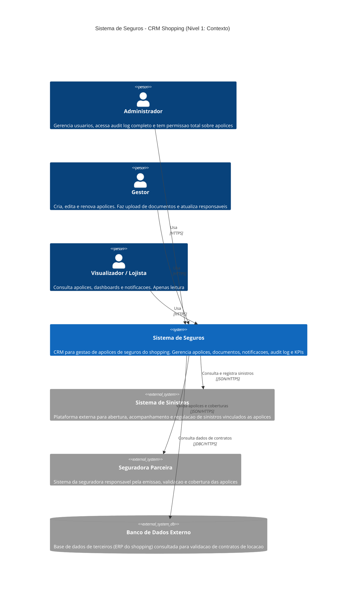
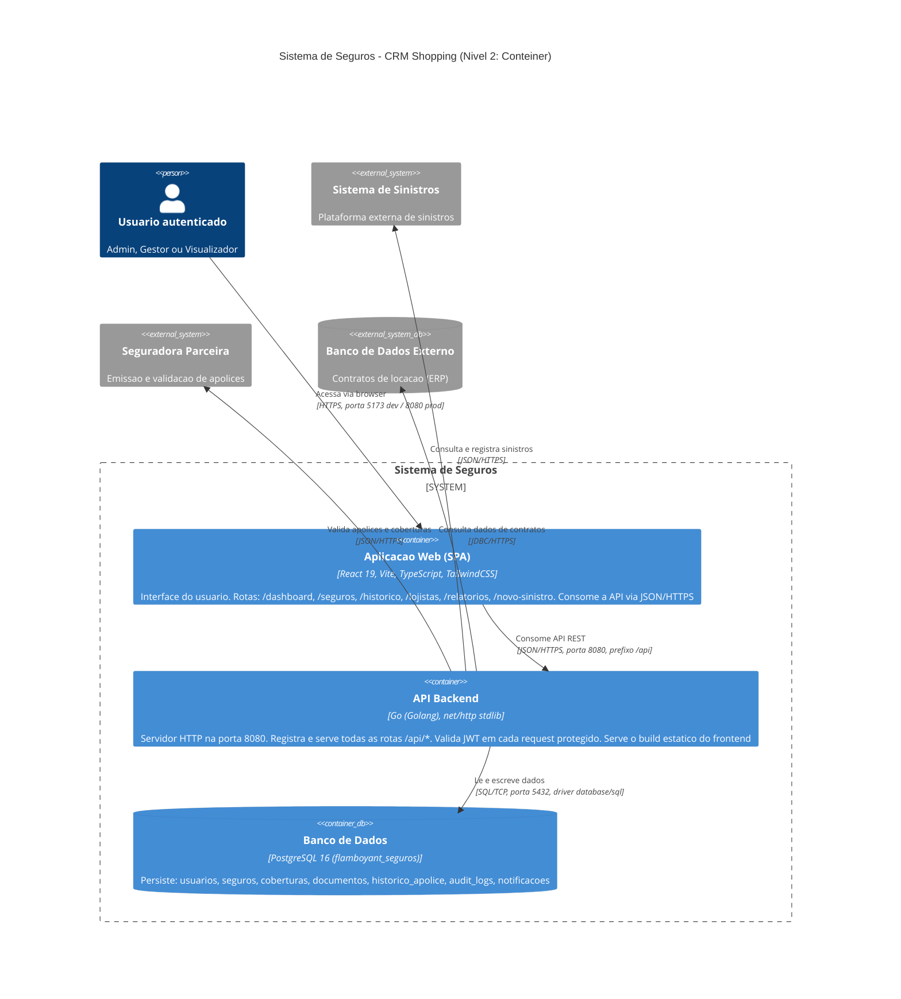
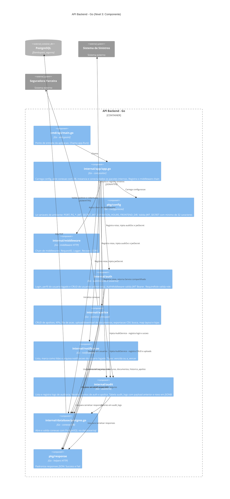
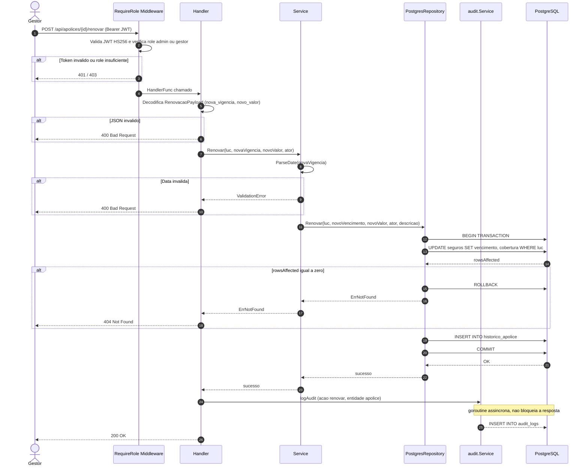

# C4 Model — Sistema de Seguros (Grupo-4-Projeto-Integrador)

Documento de arquitetura gerado a partir da leitura direta do código-fonte do projeto, utilizando o modelo C4 (Simon Brown). Todos os diagramas estão em sintaxe Mermaid, renderizada nativamente pelo GitHub.

---

## Sumário

1. [Nível 1: Contexto](#nível-1-contexto)
2. [Nível 2: Contêiner](#nível-2-contêiner)
3. [Nível 3: Componente](#nível-3-componente)
4. [Nível 4: Código](#nível-4-código)
5. [Glossário de tecnologias](#glossário-de-tecnologias)
6. [Modelo de dados](#modelo-de-dados)
7. [Mapeamento de rotas da API](#mapeamento-de-rotas-da-api)
8. [Decisões arquiteturais](#decisões-arquiteturais)

---

## Nível 1: Contexto

O Diagrama de Contexto mostra o sistema como uma caixa-preta, seus usuários e os sistemas externos com os quais ele se relaciona.

### Atores

| Ator | Papel |
|---|---|
| Administrador | Gerencia usuários e tem acesso total ao audit log e CRUD de usuários |
| Gestor | Cria, edita, renova apólices, gerencia documentos e responsáveis |
| Visualizador / Lojista | Acesso somente leitura: apólices, dashboards, notificações |

### Sistemas externos

| Sistema | Papel na arquitetura |
|---|---|
| Sistema de Sinistros | Abertura, acompanhamento e regulação de sinistros vinculados às apólices |
| Seguradora Parceira | Emissão, validação e cobertura das apólices |
| Banco de Dados Externo | Base de dados de contratos de locação (ERP do shopping) |

---

## Nível 2: Contêiner

O Diagrama de Contêiner detalha as unidades implantáveis que compõem o sistema: aplicações, bancos de dados e serviços.

### Contêineres internos

| Contêiner | Tecnologia | Responsabilidade |
|---|---|---|
| Aplicação Web (SPA) | React 19, Vite, TypeScript, TailwindCSS | Interface do usuário acessada pelo navegador. Comunica-se com a API via JSON/HTTPS |
| API Backend | Go (Golang), RESTful | Contém as regras de negócio: gestão de apólices, sinistros, relatórios e integrações. Orquestra chamadas externas e persiste dados |
| Banco de dados | PostgreSQL 16 | Persistência relacional de usuários, apólices, sinistros, contratos vinculados, logs e auditoria |

### Comunicação entre contêineres

| Origem | Destino | Protocolo / Detalhe |
|---|---|---|
| Usuário (browser) | Aplicação Web (SPA) | HTTPS |
| Aplicação Web (SPA) | API Backend | JSON/HTTPS — operações de negócio |
| API Backend | Banco de Dados | SQL/TCP (driver `database/sql`) |
| API Backend | Sistema de Sinistros | JSON/HTTPS — API REST externa |
| API Backend | Seguradora Parceira | JSON/HTTPS — API REST externa |
| API Backend | Banco de Dados Externo | JDBC/HTTPS — consulta de contratos |

---

## Nível 3: Componente

O Diagrama de Componente detalha os módulos internos do contêiner **API Backend**, mapeando 1:1 com os pacotes Go do projeto.

### Componentes do backend

| Componente | Pacote | Responsabilidade |
|---|---|---|
| Entrypoint | `cmd/api/main.go` | Ponto de entrada; chama `app.Run()` |
| Compositor | `internal/app/app.go` | Carrega config, abre DB, instancia e conecta todos os pacotes, registra middlewares |
| Configuração | `pkg/config` | Lê variáveis de ambiente e valida `JWT_SECRET` |
| Middleware | `internal/middleware` | Chain: RequestID → Logger → Recover → CORS |
| Autenticação | `internal/auth` | Login, perfil do usuário, CRUD de usuários, validação de JWT e roles |
| Apólices | `internal/apolice` | Domínio principal: CRUD, KPIs, fila de ação, documentos, exportação, busca |
| Notificações | `internal/notificacao` | Lista, marca como lida e arquiva notificações |
| Auditoria | `internal/audit` | Lista e registra ações em `audit_logs` (JSONB) |
| Conexão DB | `internal/database/postgres.go` | Abre e valida conexão PostgreSQL |
| Response | `pkg/response` | Padroniza responses JSON (`Success`, `Fail`) |

---

## Nível 4: Código

O Diagrama de Código detalha as classes (structs, interfaces e funções) do pacote de maior complexidade de domínio: **`internal/apolice`**.

### Diagrama de classes

```mermaid
classDiagram
    direction TB

    class Repository {
        <<interface>>
        +List() []Apolice, error
        +Get(luc string) Apolice, error
        +Create(model Apolice) Apolice, error
        +Update(luc string, model Apolice) Apolice, error
        +Delete(luc string) error
        +SearchApolices(query string) []Apolice, error
        +GetCoberturas(luc string) []Cobertura, error
        +GetHistorico(luc string) []HistoricoApolice, error
        +GetHistoricoGlobal(limit int) []HistoricoApolice, error
        +GetAtividadesRecentes(limit int) []AtividadeRecente, error
        +UpdateObservacoes(luc string, obs string) error
        +Renovar(luc string, novoVencimento Time, novoValor float64, ator string, descricao string) error
        +UpdateResponsavel(luc string, responsavelID int64, ator string) error
        +GetLojas() []LojaInfo, error
        +GetUsuarios() []Usuario, error
        +GetDocumentoByID(id string) Documento, error
        +GetDocumentosByApolice(luc string) []Documento, error
        +CreateDocumento(doc Documento) Documento, error
        +DeleteDocumento(id string) error
    }

    class Apolice {
        +Luc string
        +Loja string
        +Segmento string
        +Seguradora string
        +Vigencia time.Time
        +Vencimento time.Time
        +Status string
        +Cobertura float64
        +DiasRestantes int
        +Responsavel string
        +ResponsavelID *int64
        +Observacoes string
        +CNPJ string
        +NumeroApolice string
    }

    class Cobertura {
        +ID int
        +ApoliceLuc string
        +Nome string
        +Descricao string
        +Valor float64
    }

    class HistoricoApolice {
        +ID int
        +ApoliceLuc string
        +Data time.Time
        +Descricao string
        +Ator string
    }

    class Documento {
        +ID int
        +ApoliceLuc string
        +Nome string
        +ArquivoPath string
        +DataAdicao time.Time
        +DeletedAt *time.Time
    }

    class AtividadeRecente {
        +ID string
        +Luc string
        +NomeLoja string
        +Acao string
        +Responsavel string
        +Timestamp time.Time
    }

    class LojaInfo {
        +Luc string
        +Nome string
        +Segmento string
    }

    class Payload {
        +Luc string
        +Loja string
        +Segmento string
        +Seguradora string
        +Vigencia string
        +Vencimento string
        +Cobertura float64
        +Responsavel string
        +Observacoes string
    }

    class Response {
        +Luc string
        +Loja string
        +Segmento string
        +Seguradora string
        +Vigencia string
        +Vencimento string
        +Status string
        +Cobertura float64
        +DiasRestantes int
        +Responsavel string
        +ResponsavelID *int64
        +Observacoes string
        +CNPJ string
        +NumeroApolice string
    }

    class RenovacaoPayload {
        +NovaVigencia string
        +NovoValor float64
    }

    class UpdateResponsavelPayload {
        +ResponsavelID int64
    }

    class ValidationError {
        +Message string
        +Error() string
    }

    class ErrNotFound {
        <<sentinel>>
        apolice nao encontrada
    }

    class PostgresRepository {
        -db *sql.DB
        +NewRepository(db *sql.DB) PostgresRepository
        +List() []Apolice, error
        +Get(luc string) Apolice, error
        +Create(model Apolice) Apolice, error
        +Update(luc string, model Apolice) Apolice, error
        +Delete(luc string) error
        +SearchApolices(query string) []Apolice, error
        +GetCoberturas(luc string) []Cobertura, error
        +GetHistorico(luc string) []HistoricoApolice, error
        +GetHistoricoGlobal(limit int) []HistoricoApolice, error
        +GetAtividadesRecentes(limit int) []AtividadeRecente, error
        +UpdateObservacoes(luc string, obs string) error
        +Renovar(...) error
        +UpdateResponsavel(...) error
        +GetLojas() []LojaInfo, error
        +GetUsuarios() []Usuario, error
        +GetDocumentoByID(id string) Documento, error
        +GetDocumentosByApolice(luc string) []Documento, error
        +CreateDocumento(doc Documento) Documento, error
        +DeleteDocumento(id string) error
        -insertHistoricoTx(tx, luc, descricao, ator) error
        -scanApolice(scanner) Apolice, error
    }

    class Service {
        -repo Repository
        +NewService(repo Repository) Service
        +List() []Apolice, error
        +SearchApolices(query string) []Apolice, error
        +Get(luc string) Apolice, error
        +Create(payload Payload) Apolice, error
        +Update(luc string, payload Payload) Apolice, error
        +Delete(luc string) error
        +GetFilaDeAcao() []Apolice, error
        +GetCoberturas(luc string) []Cobertura, error
        +GetHistorico(luc string) []HistoricoApolice, error
        +GetHistoricoGlobal(limit int) []HistoricoApolice, error
        +GetAtividadesRecentes(limit int) []AtividadeRecente, error
        +UpdateObservacoes(luc string, obs string) error
        +Renovar(luc, novaVigencia string, novoValor float64, ator string) error
        +GetLojas() []LojaInfo, error
        +GetDocumentoByID(id string) Documento, error
        +GetDocumentosByApolice(luc string) []Documento, error
        +CreateDocumento(doc Documento) Documento, error
        +DeleteDocumento(id string) error
        -buildModel(payload Payload) Apolice, error
    }

    class Handler {
        -service Service
        -auditSvc audit.Service
        +NewHandler(service, auditSvc) Handler
        +Collection(w, r)
        +Item(routePrefix string) http.HandlerFunc
        +FilaDeAcao(w, r)
        +SearchApolices(w, r)
        +GetCoberturas(w, r)
        +GetHistorico(w, r)
        +GetAtividadesRecentes(w, r)
        +GetKPIHistory(w, r)
        +GetExpiringByWeek(w, r)
        +GetCoverageHistory(w, r)
        +GetRiskBySegment(w, r)
        +GetHealthScore(w, r)
        +UpdateObservacoes(w, r)
        +UpdateApoliceResponsavel(w, r)
        +RenovarApolice(w, r)
        +GetMapLayout(w, r)
        +GetLojas(w, r)
        +GetDocumentos(w, r)
        +UploadDocumento(w, r)
        +DownloadDocumento(w, r)
        +DeleteDocumento(w, r)
        +Exportar(w, r)
        -logAudit(r, acao, entidade, entidadeID, anterior, novo)
        -writeError(w, requestID, err)
    }

    class DomainFunctions {
        <<module>>
        +calculateDaysRemaining(vencimento time.Time) int
        +calculatePolicyStatus(vencimento time.Time) string
        +calculateHealthScore(items []Apolice, at time.Time) int
        +buildKPIHistoryPoints(items []Apolice, weeks int, metric string) []KPIHistoryPoint
        +countConformesAt(items []Apolice, at time.Time) int
        +countVencidasAt(items []Apolice, at time.Time) int
        +ParseDate(value string) time.Time, error
        +ToResponse(model Apolice) Response
        +toJSON(v any) string
    }

    PostgresRepository ..|> Repository : implementa
    Service --> Repository : depende da interface
    Service ..> Apolice : produz e consome
    Service ..> Payload : recebe como entrada
    Service ..> DomainFunctions : usa calculateDaysRemaining e calculatePolicyStatus
    Handler --> Service : chama
    Handler ..> Payload : decodifica do body HTTP
    Handler ..> Response : retorna via ToResponse
    Handler ..> RenovacaoPayload : decodifica do body HTTP
    Handler ..> UpdateResponsavelPayload : decodifica do body HTTP
    Handler ..> ValidationError : trata via writeError
    Handler ..> ErrNotFound : trata via writeError
```

### Diagrama de sequência — fluxo de renovação de apólice

---

## Glossário de tecnologias

| Camada | Tecnologia | Observação |
|---|---|---|
| Frontend | React 19 + Vite + TypeScript + TailwindCSS | SPA com tipagem estática e build rápido |
| Backend | Go (Golang), `net/http` stdlib | API RESTful, sem framework externo |
| Autenticação | JWT (HS256) | Validado em `AuthMiddleware`; roles: admin, gestor, visualizador |
| Banco de dados | PostgreSQL 16 | Persistência relacional com transações ACID |
| Infraestrutura | Docker Compose | Orquestração local dos serviços `flamboyant_web`, `flamboyant_api`, `flamboyant_db` |
| Sistemas externos | Sistema de Sinistros, Seguradora Parceira, Banco de Dados Externo (ERP) | Integrações previstas na arquitetura |

---

## Modelo de dados

Extraído de `migrations/init/01_schema.sql`:

| Tabela | Chave principal | Descrição |
|---|---|---|
| `usuarios` | `id SERIAL` | Usuários do sistema, com `CHECK` de role: admin, gestor, visualizador |
| `seguros` | `luc VARCHAR` | Apólices de seguro — entidade central do domínio |
| `coberturas` | `id SERIAL` | Coberturas vinculadas a uma apólice (`apolice_luc`) |
| `documentos` | `id SERIAL` | Arquivos PDF/imagem vinculados a uma apólice, com soft delete (`deleted_at`) |
| `historico_apolice` | `id SERIAL` | Timeline de eventos de cada apólice (criação, renovação, edição) |
| `audit_logs` | `id BIGSERIAL` | Log imutável de ações, com payload anterior/novo em JSONB |
| `notificacoes` | `id SERIAL` | Alertas de apólices vencidas ou a vencer, por usuário |

---

## Mapeamento de rotas da API

Extraído de `internal/apolice/routes.go`, `internal/auth/routes.go`, `internal/notificacao/routes.go` e `internal/audit/routes.go`.

| Método | Rota | Role exigida | Handler |
|---|---|---|---|
| POST | `/api/auth/login` | público | `auth.Login` |
| GET | `/api/auth/me` | autenticado | `auth.Me` |
| GET / POST / PATCH | `/api/usuarios` | admin | `auth` CRUD de usuários |
| GET | `/api/apolices` | autenticado | `apolice.Collection` |
| POST | `/api/apolices` | admin, gestor | `apolice.Collection` |
| GET / PUT / PATCH | `/api/apolices/{id}` | autenticado / admin+gestor (escrita) | `apolice.Item` |
| DELETE | `/api/apolices/{id}` | admin | `apolice.Item` |
| PATCH | `/api/apolices/{id}/observacoes` | admin, gestor | `apolice.UpdateObservacoes` |
| PATCH | `/api/apolices/{id}/responsavel` | admin, gestor | `apolice.UpdateApoliceResponsavel` |
| POST | `/api/apolices/{id}/renovar` | admin, gestor | `apolice.RenovarApolice` |
| GET | `/api/apolices/{id}/coberturas` | autenticado | `apolice.GetCoberturas` |
| GET | `/api/apolices/{id}/historico` | autenticado | `apolice.GetHistorico` |
| GET | `/api/apolices/{id}/documentos` | autenticado | `apolice.GetDocumentos` |
| POST | `/api/apolices/{id}/documentos` | admin, gestor | `apolice.UploadDocumento` |
| GET | `/api/documentos/{id}/download` | autenticado | `apolice.DownloadDocumento` |
| DELETE | `/api/documentos/{id}` | admin, gestor | `apolice.DeleteDocumento` |
| GET | `/api/apolices/atividade-recente` | autenticado | `apolice.GetAtividadesRecentes` |
| GET | `/api/apolices/exportar` | autenticado | `apolice.Exportar` |
| GET | `/api/apolices/search` | autenticado | `apolice.SearchApolices` |
| GET | `/api/fila-de-acao` | autenticado | `apolice.FilaDeAcao` |
| GET | `/api/kpis/history` | autenticado | `apolice.GetKPIHistory` |
| GET | `/api/kpis/expiring-by-week` | autenticado | `apolice.GetExpiringByWeek` |
| GET | `/api/kpis/coverage-history` | autenticado | `apolice.GetCoverageHistory` |
| GET | `/api/kpis/risk-by-segment` | autenticado | `apolice.GetRiskBySegment` |
| GET | `/api/kpis/health-score` | autenticado | `apolice.GetHealthScore` |
| GET | `/api/map-layout` | autenticado | `apolice.GetMapLayout` |
| GET | `/api/lojas` | autenticado | `apolice.GetLojas` |
| GET | `/api/notificacoes` | autenticado | `notificacao.List` |
| PATCH | `/api/notificacoes/marcar-lidas` | autenticado | `notificacao.MarcarLidas` |
| DELETE | `/api/notificacoes/arquivadas` e `/api/notificacoes/{id}` | autenticado | `notificacao.Delete` |
| GET | `/api/admin/audit` | admin | `audit.List` |
| POST | `/api/admin/audit` | admin | `audit.Create` |

---

## Decisões arquiteturais

| Decisão | Justificativa |
|---|---|
| Go com `net/http` stdlib, sem framework | Reduz dependências externas; suficiente para o volume de rotas do projeto |
| Interface `Repository` em `internal/apolice` | Inverte a dependência entre `Service` e `PostgresRepository`, facilitando testes com mocks |
| Auditoria injetada via `audit.Service` compartilhado | Centraliza o log de ações em uma única tabela (`audit_logs`) sem acoplar os pacotes de domínio entre si |
| Transações SQL em operações de múltiplas tabelas (ex: renovação) | Garante atomicidade entre `UPDATE seguros` e `INSERT historico_apolice` |
| JWT (HS256) com roles embutidas | Evita chamada adicional ao banco para checagem de permissão em cada request |
| Frontend servido pelo próprio backend em produção | Simplifica o deploy — um único binário Go serve API e assets estáticos |
| PostgreSQL com schema único (`flamboyant_seguros`) | Modelo relacional adequado ao domínio de apólices, coberturas e histórico, com integridade referencial |
| Sistemas externos (Sinistros, Seguradora, ERP) representados como `System_Ext` | Embora não implementados no código atual, fazem parte do domínio de negócio e da evolução planejada da arquitetura |
