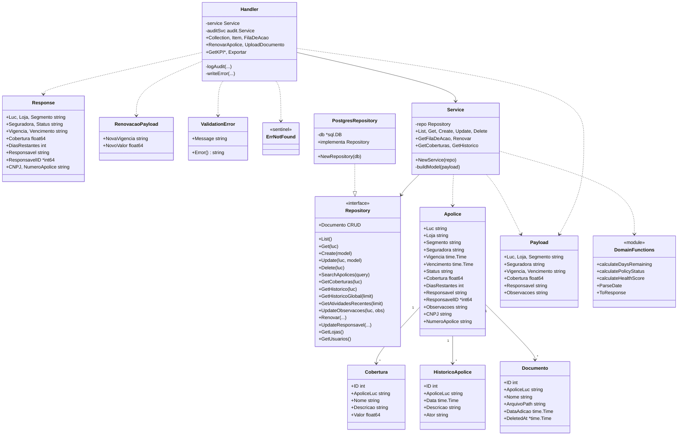
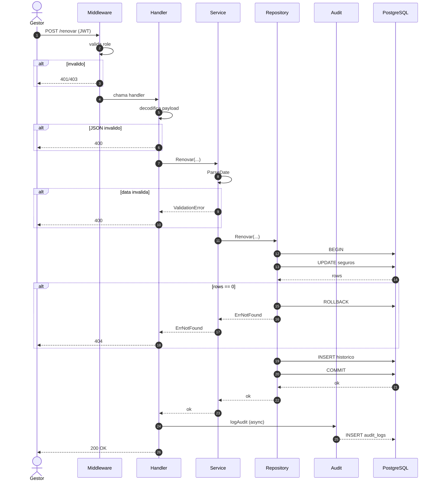

```

### Componentes do backend

| Componente | Pacote | Responsabilidade |
|---|---|---|
| Entrypoint | `cmd/api/main.go` | Ponto de entrada; chama `app.Run()` |
| Compositor | `internal/app/app.go` | Carrega config, abre DB, instancia e conecta todos os pacotes, registra middlewares |
| Configuração | `pkg/config` | Lê variáveis de ambiente e valida `JWT_SECRET` |
| Middleware | `internal/middleware` | Chain: RequestID → Logger → Recover → CORS |
| Autenticação | `internal/auth` | Login, perfil do usuário, CRUD de usuários, validação de JWT e roles |
| Apólices | `internal/apolice` | Domínio principal: CRUD, KPIs, fila de ação, documentos, exportação, busca |
| Notificações | `internal/notificacao` | Lista, marca como lida e arquiva notificações |
| Auditoria | `internal/audit` | Lista e registra ações em `audit_logs` (JSONB) |
| Conexão DB | `internal/database/postgres.go` | Abre e valida conexão PostgreSQL |
| Response | `pkg/response` | Padroniza responses JSON (`Success`, `Fail`) |

---

## Nível 4: Código

O Diagrama de Código detalha as classes (structs, interfaces e funções) do pacote de maior complexidade de domínio: **`internal/apolice`**.

### Diagrama de classes



### Diagrama de sequência — fluxo de renovação de apólice


