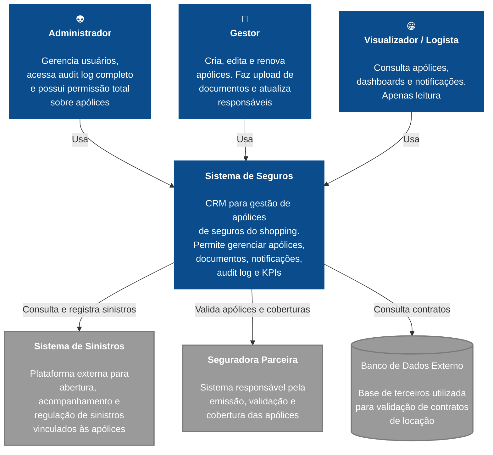

```mermaid
flowchart TB

%% ===== USUÁRIOS =====

Admin["👽<br/><b>Administrador</b><br/><br/>Gerencia usuários,<br/>acessa audit log completo<br/>e possui permissão total<br/>sobre apólices"]

Gestor["🫡<br/><b>Gestor</b><br/><br/>Cria, edita e renova<br/>apólices. Faz upload de<br/>documentos e atualiza<br/>responsáveis"]

Logista["😀<br/><b>Visualizador / Logista</b><br/><br/>Consulta apólices,<br/>dashboards e notificações.<br/>Apenas leitura"]

%% ===== SISTEMA =====

Sistema["<b>Sistema de Seguros</b><br/><br/>CRM para gestão de apólices<br/>de seguros do shopping.<br/>Permite gerenciar apólices,<br/>documentos, notificações,<br/>audit log e KPIs"]

%% ===== EXTERNOS =====

Sinistros["<b>Sistema de Sinistros</b><br/><br/>Plataforma externa para<br/>abertura, acompanhamento e<br/>regulação de sinistros<br/>vinculados às apólices"]

Seguradora["<b>Seguradora Parceira</b><br/><br/>Sistema responsável pela<br/>emissão, validação e<br/>cobertura das apólices"]

Banco[("Banco de Dados Externo<br/><br/>Base de terceiros utilizada<br/>para validação de contratos<br/>de locação")]

%% ===== RELAÇÕES =====

Admin -->|"Usa"| Sistema
Gestor -->|"Usa"| Sistema
Logista -->|"Usa"| Sistema

Sistema -->|"Consulta e registra sinistros"| Sinistros

Sistema -->|"Valida apólices e coberturas"| Seguradora

Sistema -->|"Consulta contratos"| Banco

%% ===== ESTILO =====

classDef azul fill:#0B4D8C,color:#fff,stroke:#0B4D8C,stroke-width:2px;
classDef cinza fill:#9A9A9A,color:#fff,stroke:#7A7A7A,stroke-width:2px;

class Admin,Gestor,Logista,Sistema azul;
class Sinistros,Seguradora,Banco cinza;
```
