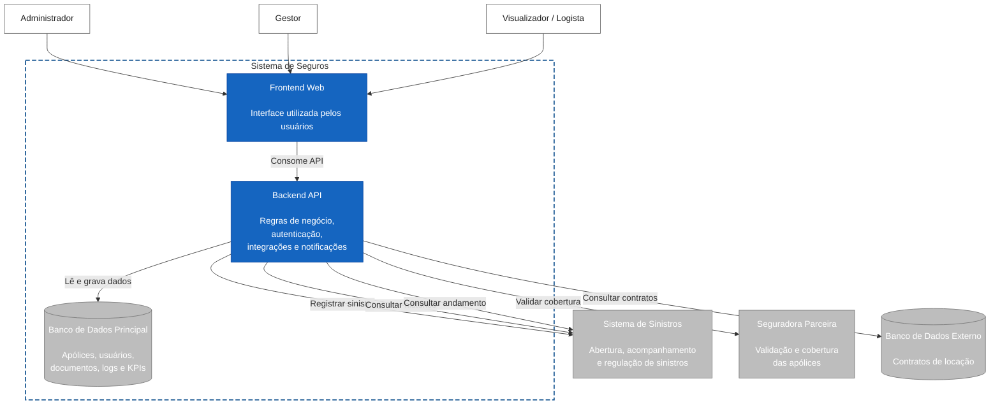

```mermaid
flowchart TB

%% ===== ATORES =====

Admin["Administrador"]
Gestor["Gestor"]
Logista["Visualizador / Logista"]

%% ===== SISTEMA =====

subgraph Sistema["Sistema de Seguros"]
style Sistema fill:none,stroke:#0B4D8C,stroke-width:2px,stroke-dasharray: 8 4

    Frontend["Frontend Web<br/><br/>Interface utilizada pelos usuários"]

    Backend["Backend API<br/><br/>Regras de negócio,<br/>autenticação,<br/>integrações e notificações"]

    Database[("Banco de Dados Principal<br/><br/>Apólices, usuários,<br/>documentos, logs e KPIs")]

    Frontend -->|"Consome API"| Backend
    Backend -->|"Lê e grava dados"| Database

end

%% ===== SISTEMAS EXTERNOS =====

Sinistros["Sistema de Sinistros<br/><br/>Abertura, acompanhamento<br/>e regulação de sinistros"]

Seguradora["Seguradora Parceira<br/><br/>Validação e cobertura<br/>das apólices"]

Banco[("Banco de Dados Externo<br/><br/>Contratos de locação")]

%% ===== RELAÇÕES =====

Admin --> Frontend
Gestor --> Frontend
Logista --> Frontend

Backend -->|"Registrar sinistro"| Sinistros
Backend -->|"Consultar histórico"| Sinistros
Backend -->|"Consultar andamento"| Sinistros

Backend -->|"Validar cobertura"| Seguradora

Backend -->|"Consultar contratos"| Banco

%% ===== ESTILOS =====

classDef usuario fill:#ffffff,stroke:#666,color:#222;
classDef container fill:#1565C0,stroke:#0D47A1,color:#fff;
classDef externo fill:#BDBDBD,stroke:#757575,color:#fff;
classDef banco fill:#BDBDBD,stroke:#757575,color:#fff;

class Admin,Gestor,Logista usuario;

class Frontend,Backend container;

class Sinistros,Seguradora externo;

class Database,Banco banco;
```
