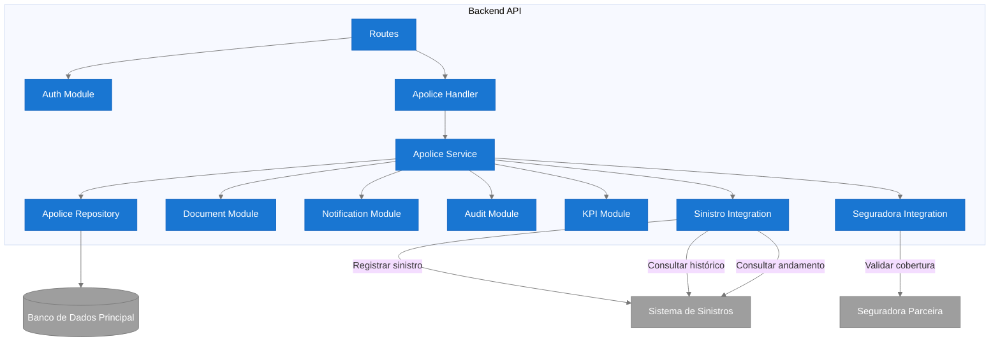

```mermaid
%%{init:{
"theme":"base",
"themeVariables":{
"lineColor":"#777777"
}
}}%%

flowchart TB

subgraph API["Backend API"]

Routes["Routes"]

Auth["Auth Module"]

Handler["Apolice Handler"]

Service["Apolice Service"]

Repository["Apolice Repository"]

Documents["Document Module"]

Notifications["Notification Module"]

Audit["Audit Module"]

KPI["KPI Module"]

SinistroGateway["Sinistro Integration"]

SeguradoraGateway["Seguradora Integration"]

Routes --> Auth
Routes --> Handler

Handler --> Service

Service --> Repository
Service --> Documents
Service --> Notifications
Service --> Audit
Service --> KPI

Service --> SinistroGateway
Service --> SeguradoraGateway

end

Database[("Banco de Dados Principal")]

Sinistros["Sistema de Sinistros"]

Seguradora["Seguradora Parceira"]

Repository --> Database

SinistroGateway -->|"Registrar sinistro"| Sinistros
SinistroGateway -->|"Consultar histórico"| Sinistros
SinistroGateway -->|"Consultar andamento"| Sinistros

SeguradoraGateway -->|"Validar cobertura"| Seguradora

classDef azul fill:#1976D2,color:#fff,stroke:#1565C0;
classDef cinza fill:#9E9E9E,color:#fff,stroke:#7A7A7A;

class Routes,Auth,Handler,Service,Repository,Documents,Notifications,Audit,KPI,SinistroGateway,SeguradoraGateway azul;

class Sinistros,Seguradora,Database cinza;
```
