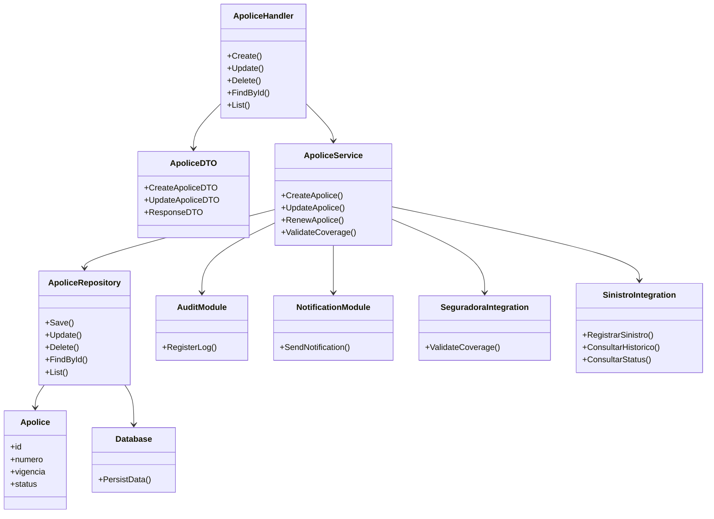

```mermaid
classDiagram

class ApoliceHandler{
+Create()
+Update()
+Delete()
+FindById()
+List()
}

class ApoliceDTO{
+CreateApoliceDTO
+UpdateApoliceDTO
+ResponseDTO
}

class ApoliceService{
+CreateApolice()
+UpdateApolice()
+RenewApolice()
+ValidateCoverage()
}

class ApoliceRepository{
+Save()
+Update()
+Delete()
+FindById()
+List()
}

class Apolice{
+id
+numero
+vigencia
+status
}

class AuditModule{
+RegisterLog()
}

class NotificationModule{
+SendNotification()
}

class SeguradoraIntegration{
+ValidateCoverage()
}

class SinistroIntegration{
+RegistrarSinistro()
+ConsultarHistorico()
+ConsultarStatus()
}

class Database{
+PersistData()
}

ApoliceHandler --> ApoliceDTO
ApoliceHandler --> ApoliceService

ApoliceService --> ApoliceRepository
ApoliceService --> AuditModule
ApoliceService --> NotificationModule
ApoliceService --> SeguradoraIntegration
ApoliceService --> SinistroIntegration

ApoliceRepository --> Apolice
ApoliceRepository --> Database
```
